# 2nd-Project
This project analyzes a large-scale financial transaction dataset containing over 6.3 million transactions to identify fraud patterns, transaction anomalies, and high-risk transaction categories.

The analysis was performed using:

  - SQL for data exploration and business queries
  - Python for data processing and visualization
  - Pandas & NumPy for data manipulation
  - Matplotlib for dashboard creation
  - PDF reporting for dashboard export

The final output is a two-page fraud detection dashboard providing insights into fraud prevalence, transaction behavior, risk patterns, and anomaly detection.
## Dataset
Due to file size constraints, the dataset is not included in this repository.
Download it from Kaggle: [PaySim Synthetic Financial Dataset](https://www.kaggle.com/datasets/ealaxi/paysim1)

## Bank-Churn-Analysis-Dashboard

### Dashboard Link : https://github.com/Masoom0112/2nd-Project/blob/8731aa666171b8fac5b3c29c89fce289822ae381/Fraud_Detection_Dashboard.pdf

## Problem Statement

Financial fraud can result in significant monetary losses and operational risks for financial institutions.

The objective of this project is to:

- Measure the overall fraud rate.
- Identify transaction types most vulnerable to fraud.
- Compare fraudulent and legitimate transaction behaviors.
- Analyze fraud occurrence across different transaction amounts.
- Evaluate the effectiveness of fraud flagging mechanisms.
- Investigate balance inconsistencies associated with fraudulent activities.

## Tools & Technologies
- SQL
- Python
- Pandas
- NumPy
- Matplotlib
- GridSpec
- Jupyter Notebook
- PDF Export

## Phase 1: Data Loading

In this phase, the required Python libraries were imported and the financial transaction dataset was loaded into a Pandas DataFrame. Basic data exploration was performed by reviewing the dataset structure, sample records, data types, and missing values to ensure the data was ready for analysis and visualization.

## Phase 2: SQL Data Exploration

The dataset was explored using SQL to identify fraud trends and customer transaction behavior.

Analysis Performed :

- step 1: Fraud transaction count
- step 2: Fraud rate calculation

        * Code :
  
           SELECT
               COUNT(*) AS total_txn,
               SUM(CASE WHEN isFraud = 1 THEN 1 ELSE 0 END) AS fraud_txn,
                CAST(100.0 * SUM(CASE WHEN isFraud = 1 THEN 1 ELSE 0 END) / COUNT(*) AS DECIMAL(10,4)) AS fraud_rate_pct
           FROM dbo.fraud_transactions;
  
        * Code Snapshot :
  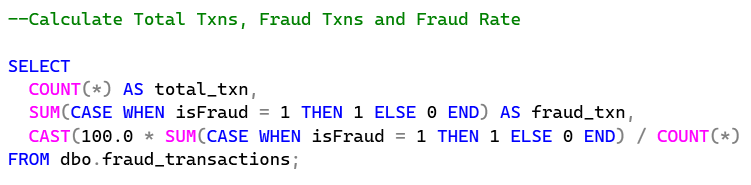
  
        * Output Snapshot : !
  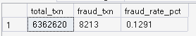
  

- step 3: Transaction type distribution
- step 4: Fraud by transaction type

         * Code :

             select
                type , 
                COUNT(*) as total_txn,
                SUM(case when isFraud = 1 then 1 else 0 end) as fraud_txn,
                cast(100.0 * SUM(case when isFraud = 1 then 1 else 0 end) as decimal(10,4)) / nullif(COUNT(*),0) as fraud_rate_pct
            from fraud_transactions
            group by type
            order by fraud_rate_pct desc
  
         * Code Snapshot :
  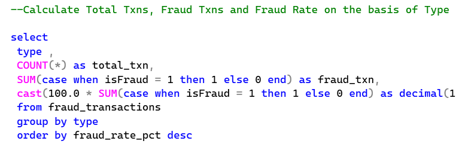
  
         * Output Snapshot :
  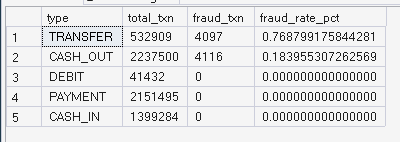
  

- step 5: Average transaction amount
- step 6: Fraud amount comparison

         * Code :

              select
                 type,
                 AVG(case when isFraud = 1 then amount end) as Avg_Fraud_Amount,
                 avg(case when isFraud = 0 then amount end) as Avg_NonFraud_Amount
              from fraud_transactions
              GROUP BY type
              ORDER BY Avg_Fraud_Amount desc,Avg_NonFraud_Amount desc
  
         * Code Snapshot :
  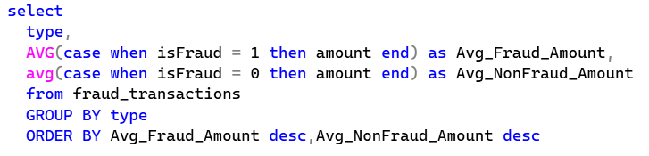
  
         * Output Snapshot :
  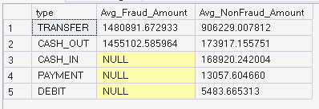
  

- step 7: Amount-band analysis

         * Code :

              select (case when amount between 0 and 10000 then 'lower band' 
                           else (case when amount between 10001 and 100000 then 'medium' 
                           else (case when amount between 100001 and 1000000 then 'high' 
                           else 'very high' end) end) end ) amount_band,
                     count(*) Total_TXN,
                     sum(CASE WHEN isFraud = 1 then 1 else 0 end) Fraud_txn,
                     100.0 * sum(CASE WHEN isFraud = 1 then 1 else 0 end) / count(*) Fraud_TXN_Pct
              from fraud_transactions
              group by (case when amount between 0 and 10000 then 'lower band' 
                              else (case when amount between 10001 and 100000 then 'medium' 
                              else (case when amount between 100001 and 1000000 then 'high' 
                              else 'very high' end) end) end )
  
         * Code Snapshot :
  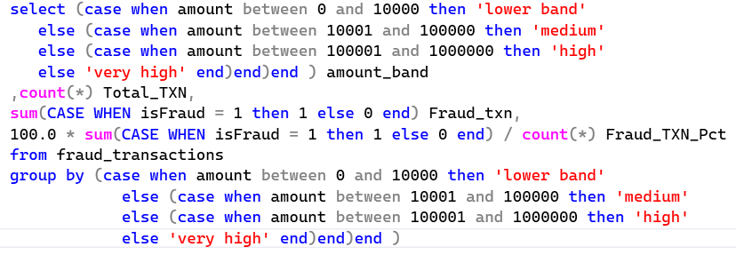
  
         * Output Snapshot :
  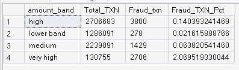
  

- step 8: Fraud flag analysis

         * Code :

                 select
                       count(case when isFlaggedFraud = 1 and isFraud = 1 then 1 end) as 'true positives' ,
                       count(case when isFlaggedFraud = 1 and isFraud = 0 then 1 end) as 'false positives' ,
                       count(case when isFlaggedFraud = 0 and isFraud = 1 then 1 end) as 'false negatives' ,
                       count(case when isFlaggedFraud = 0 and isFraud = 0 then 1 end) as 'true negatives'
                 from fraud_transactions

                select 
                       1.0 * count(case when isFlaggedFraud = 1 and isFraud = 1 then 1 end) / (count(case when isFlaggedFraud = 1 and isFraud = 1 then 1 end) + count(case when                                       isFlaggedFraud = 1 and isFraud = 0 then 1 end)) 'Precision',
                       1.0 * count(case when isFlaggedFraud = 1 and isFraud = 1 then 1 end) / (count(case when isFlaggedFraud = 1 and isFraud = 1 then 1 end) + count(case when                                       isFlaggedFraud = 0 and isFraud = 1 then 1 end)) 'Recall'
                from fraud_transactions
  
         * Code Snapshot :
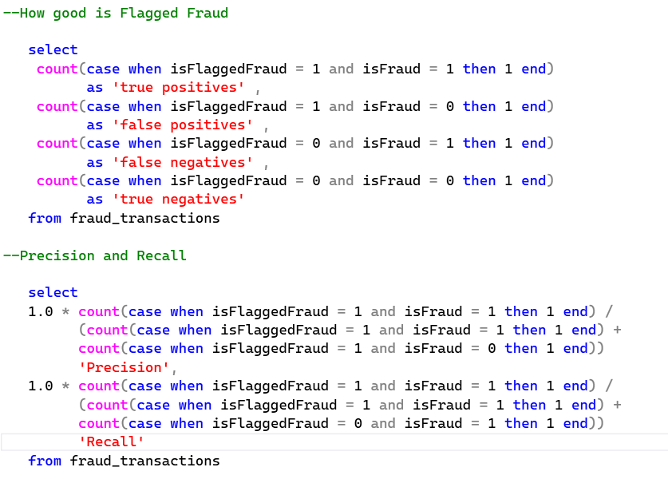
  
         * Output Snapshot : 
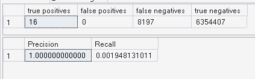
  

- step 9: Balance mismatch analysis

         * Code :

              select COUNT(*) as total_TXN,
                     COUNT(case when oldbalanceOrg - amount != newbalanceOrig then 1 end) as Mismatch_TXN
              from fraud_transactions where isFraud = 1

              select COUNT(*) as total_TXN,
                     COUNT(case when oldbalanceOrg - amount != newbalanceOrig then 1 end) as Mismatch_TXN
              from fraud_transactions

             select TYPE ,
                    COUNT(*) as total_TXN,
                    COUNT(case when oldbalanceOrg - amount != newbalanceOrig then 1 end) as Mismatch_TXN,
                    100.0 * COUNT(case when oldbalanceOrg - amount != newbalanceOrig then 1 end) / COUNT(*) AS mismatch_rate_pct
             from fraud_transactions where type in ('CASH_OUT' , 'TRANSFER')
             GROUP BY type
  
         * Code Snapshot :
  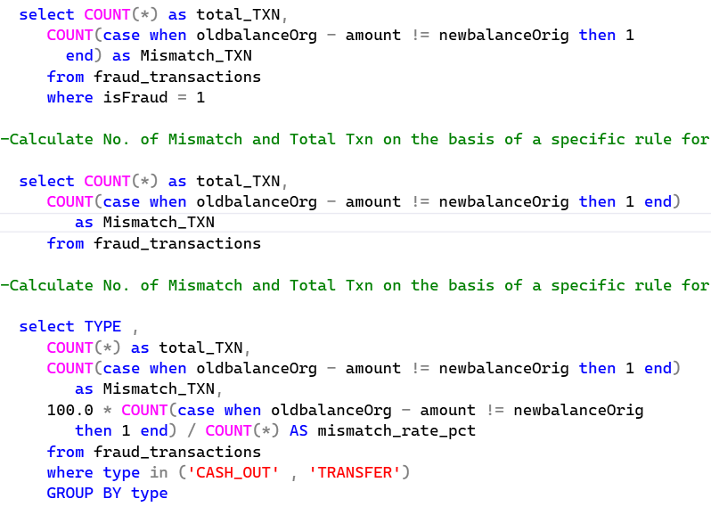
  
         * Output Snapshot :
  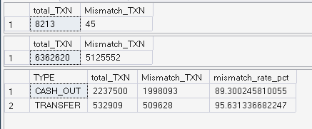
  

## Phase 3: KPI Creation

- Step 10: Calculate Total Transactions
- Step 11: Calculate Fraud Transactions
- Step 12: Calculate Fraud Rate
- Step 13: Calculate Average Fraud Amount
- Step 14: Calculate Average Legitimate Amount
- Step 15: Calculate Precision
- Step 16: Calculate Recall
- Step 14: Calculate F1 Score

         * Code :

                    total_txn  = len(df)
                    fraud_txn  = df['isFraud'].sum()
                    fraud_rate = round(100 * fraud_txn / total_txn, 2)

                    avg_fraud_amt    = round(df[df['isFraud']==1]['amount'].mean(), 2)
                    avg_nonfraud_amt = round(df[df['isFraud']==0]['amount'].mean(), 2)

                    tp = int(((df['isFlaggedFraud']==1) & (df['isFraud']==1)).sum())
                    fp = int(((df['isFlaggedFraud']==1) & (df['isFraud']==0)).sum())
                    fn = int(((df['isFlaggedFraud']==0) & (df['isFraud']==1)).sum())
                    tn = int(((df['isFlaggedFraud']==0) & (df['isFraud']==0)).sum())

                    precision = round(tp / (tp + fp), 4) if (tp + fp) > 0 else 0
                    recall    = round(tp / (tp + fn), 4) if (tp + fn) > 0 else 0
                    f1        = round(2 * precision * recall / (precision + recall), 4) if (precision + recall) > 0 else 0

                    print("Total TXN      :", total_txn)
                    print("Fraud TXN      :", fraud_txn)
                    print("Fraud Rate     :", fraud_rate, "%")
                    print("Avg Fraud Amt  :", avg_fraud_amt)
                    print("Avg Legit Amt  :", avg_nonfraud_amt)
                    print("Precision      :", precision)
                    print("Recall         :", recall)
                    print("F1 Score       :", f1)
  
         * Code Snapshot :
  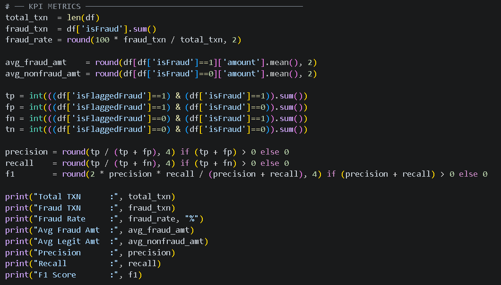
  
         * Output Snapshot :
  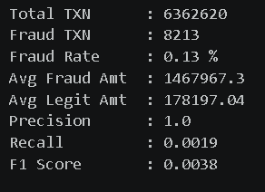

## Phase 4: Feature Construction

- Step 15: Amount Band Creation

         * Code :

                  def amt_band(x):
                          if x >= 1_000_000:  return '>=1M'
                          elif x >= 100_000:  return '100K-1M'
                          elif x >= 10_000:   return '10K-100K'
                          else:               return '0-10K'
  
         * Code Snapshot :
  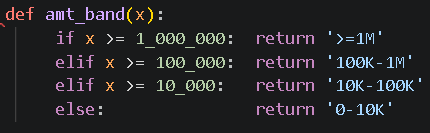
  
- Step 16: Balance Mismatch Detection

         * Code :

               df['mismatch'] = (df['oldbalanceOrg'] - df['amount']).round(2) != df['newbalanceOrig'].round(2)
  
         * Code Snapshot :
  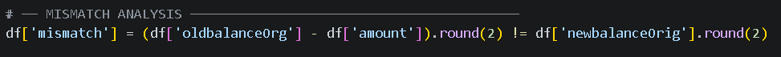
  
## Phase 5: Dashboard Design

### Page 1: Fraud Detection - Overview

KPIs:
- Total Transactions
- Fraud Transactions
- Fraud Rate
- Average Fraud Amount
- Average Legitimate Amount
- Precision
- Recall
- F1 Score

Visuals:

- Fraud Transactions by Type
- Fraud Share by Type

       * Code :

                  # ── FIGURE ────────────────────────────────────────────────────
                  fig1 = plt.figure(figsize=(22, 14))
                  fig1.patch.set_facecolor(BG)
                  fig1.text(0.04, 0.97, 'Financial Fraud Detection — Overview', fontsize=30, fontweight='bold', color=TEXT, va='top')

                  # ── KPI CARDS ─────────────────────────────────────────────────
                  kpis = [
                            ('Total Transactions', f'{total_txn:,}',            LEGIT),
                            ('Fraud Transactions', f'{fraud_txn:,}',            FRAUD),
                            ('Fraud Rate',         f'{fraud_rate}%',            FRAUD),
                            ('Avg Fraud Amount',   f'${avg_fraud_amt:,.0f}',    TRANSFER),
                            ('Avg Legit Amount',   f'${avg_nonfraud_amt:,.0f}', LEGIT),
                            ('Precision',          f'{precision:.2%}',          MINT),
                            ('Recall',             f'{recall:.4f}',             CASHOUT),
                            ('F1 Score',           f'{f1:.4f}',                 PURPLE),
                         ]

                 for i, (label, value, color) in enumerate(kpis):
                          ax = fig1.add_axes([0.02 + i*0.118, 0.82, 0.108, 0.10])
                          ax.set_facecolor(CARD)
                          for spine in ax.spines.values():
                              spine.set_edgecolor(BORDER)
                              spine.set_linewidth(1.2)
                          ax.set_xticks([])
                          ax.set_yticks([])
                          ax.text(0.5, 0.65, value, ha='center', va='center', fontsize=20, fontweight='bold', color=color, transform=ax.transAxes)
                          ax.text(0.5, 0.25, label, ha='center', va='center', fontsize=15, color=SUBTEXT, transform=ax.transAxes)

                 # ── DONUT 1 — Total TXN by Type ───────────────────────────────
                 ax1 = fig1.add_axes([0.05, 0.10, 0.38, 0.65])
                 ax1.pie(df['type'].value_counts(), labels=df['type'].value_counts().index, autopct='%1.1f%%', wedgeprops=dict(width=0.4), colors=[LEGIT, FRAUD, TRANSFER,                               CASHOUT, HIGHLIGHT], textprops=dict(fontsize=15))
                 ax1.set_title('Total Transactions by Type', fontsize=20, fontweight='bold', color=TEXT, pad=40)

                 # ── DONUT 2 — Fraud TXN Share by Type ─────────────────────────
                 ax2 = fig1.add_axes([0.52, 0.10, 0.38, 0.65])
                 ax2.pie(df[df['isFraud']==1]['type'].value_counts(), labels=df[df['isFraud']==1]['type'].value_counts().index, autopct='%1.1f%%', wedgeprops=dict(width=0.4),
                        colors=[FRAUD, TRANSFER], textprops=dict(fontsize=15))
                 ax2.set_title('Fraud Transactions Share by Type', fontsize=20, fontweight='bold', color=TEXT, pad=40)

                 plt.show()

       * Code Snapshot :
  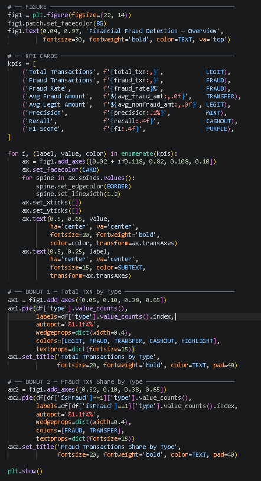
  
       * Page-1 Snapshot :
  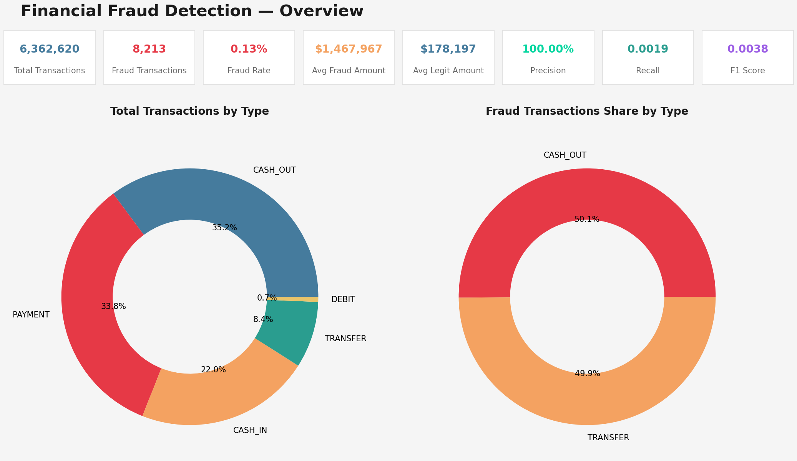

### Page 2: Fraud Detection - Deep Dive

Visuals:

- Fraud Transactions by Type
- Fraud Rate by Transaction Type
- Fraud Share by Type
- Average Amount: Fraud vs Legitimate
- Average Amount: Flagged vs Not Flagged Fraud
- Fraud Rate by Amount Band
- Fraud Percentage by Amount Band
- Flagged Fraud Percentage by Amount Band
- Balance Mismatch Analysis

       * Code :

               # ── PAGE 2 FIGURE : TEST─────────────────────────────────────────────
               fig2 = plt.figure(figsize=(22, 20))
               fig2.patch.set_facecolor(BG)
               fig2.text(0.04, 0.97, 'Financial Fraud Detection — Deep Dive', fontsize=35, fontweight='bold', color=TEXT, va='top')

               gs = gridspec.GridSpec(4, 3, figure=fig2, top=0.92, hspace=0.5, wspace=0.3)

               # Chart 1
               ax = fig2.add_subplot(gs[0, 0])
               ax.barh(by_type.index, by_type['fraud'], color=CASHOUT)
               ax.set_title('Fraud Transactions by Type', fontsize=17, fontweight='bold', color=TEXT, pad=14)
               ax.set_xlabel('Number of Fraud Transactions', fontsize=14, color=SUBTEXT)
               ax.tick_params(axis='both', labelsize=12)

               # Chart 2
               ax = fig2.add_subplot(gs[0, 1])
               ax.barh(by_type.index, by_type['rate'], color=TRANSFER)
               ax.set_title('Fraud Rate by Type (%)', fontsize=17, fontweight='bold', color=TEXT, pad=10)
               ax.set_xlabel('Fraud Rate', fontsize=14, color=SUBTEXT)
               ax.tick_params(axis='both', labelsize=12)

               # Chart 3
               ax = fig2.add_subplot(gs[0, 2])
               ax.barh(by_type.index, 100.0 * by_type['fraud'] / by_type['fraud'].sum(), color=PURPLE)
               ax.set_title('% Share of Fraud by Type', fontsize=17, fontweight='bold', color=TEXT, pad=10)
               ax.set_xlabel('% of Fraud Transactions', fontsize=14, color=SUBTEXT)
               ax.tick_params(axis='both', labelsize=12)

               # Only keep types that exist in both
               common_types = avg_fraud_type.index
               avg_legit_aligned = avg_legit_type.reindex(common_types)
               x = np.arange(len(common_types))
               width = 0.35
               ax = fig2.add_subplot(gs[1, 0])
               ax.bar(x - width/2, avg_legit_aligned/1000, width, color=LEGIT, label='Legitimate')
               ax.bar(x + width/2, avg_fraud_type/1000, width, color=FRAUD, label='Fraud')
               ax.set_xticks(x)
               ax.set_xticklabels(common_types, rotation=45, fontsize=12)
               ax.set_title('Avg Amount: Fraud vs Legit by Type', fontsize=17, fontweight='bold', color=TEXT, pad=10)
               ax.set_ylabel('Avg Amount (thousands $)', fontsize=14, color=SUBTEXT)
               ax.tick_params(axis='both', labelsize=12)
               ax.legend(fontsize=11)

               ax = fig2.add_subplot(gs[1, 1])
               labels = ['Not Flagged', 'Flagged']
               values = avg_flagged.values
               ax.bar(labels, values/1000, color=[MINT, HIGHLIGHT], width=0.4)
               ax.set_title('Avg Amount: Flagged vs Not Flagged Fraud', fontsize=17, fontweight='bold', color=TEXT, pad=10)
               ax.set_ylabel('Avg Amount (thousands $)', fontsize=14, color=SUBTEXT)
               ax.tick_params(axis='both', labelsize=12)

               ax = fig2.add_subplot(gs[1, 2])
               labels = band_order
               values = by_band['rate'].values
               ax.bar(labels, values, color=[MINT, HIGHLIGHT, TRANSFER, LEGIT], width=0.4)
               ax.set_title('Fraud Rate by Amount Band', fontsize=17, fontweight='bold', color=TEXT, pad=10)
               ax.set_ylabel('raud Rate (%)', fontsize=14, color=SUBTEXT)
               ax.tick_params(axis='both', labelsize=12)

               # ── ROW 2 — MISMATCH TABLE (FULL WIDTH) ──────────────────────
               ax = fig2.add_subplot(gs[2, 0:3])
               ax.axis('off')
               ax.set_facecolor(BG)

               table_data = [
                       ['All Transactions',   
                       f"{mismatch_all['count']:,}",   
                       f"{mismatch_all['sum']:,}",   
                       f"{100*mismatch_all['sum']/mismatch_all['count']:.2f}%"],
                       ['Fraud Transactions', 
                       f"{mismatch_fraud['count']:,}",   
                       f"{mismatch_fraud['sum']:,}",   
                       f"{100*mismatch_fraud['sum']/mismatch_fraud['count']:.2f}%"],
                  ]

               col_labels = ['Category', 'Total TXN', 'Mismatch TXN', 'Mismatch %']

               table = ax.table(cellText=table_data, colLabels=col_labels, loc='center', cellLoc='center')

               table.auto_set_font_size(False)
               table.set_fontsize(13)
               table.scale(1, 3)

              # Style header row
              for j in range(4):
                     table[0, j].set_facecolor(FRAUD)
                     table[0, j].set_text_props(color='white', fontweight='bold')

              # Style data rows
              for i in range(1, 3):
                 for j in range(4):
                       table[i, j].set_facecolor(CARD)
                       table[i, j].set_text_props(color=TEXT)

              ax.set_title('Balance Mismatch Analysis', fontsize=17, fontweight='bold', color=TEXT, pad=10)

              # ── ROW 3 — BOTH FUNNELS SIDE BY SIDE ────────────────────────
              ax1 = fig2.add_subplot(gs[3, 0:2])
              ax1.set_facecolor(BG)

              funnel_vals = by_band['rate'].reindex(band_order).values
              bar_colors = [MINT, HIGHLIGHT, TRANSFER, PURPLE]

              for i, (val, label, color) in enumerate(zip(funnel_vals, band_order, bar_colors)):
                      ax1.barh(label, val, color=color, height=0.5)
                      ax1.text(val + 0.01, i, f'{val:.2f}%', va='center', fontsize=13, color=TEXT)

              ax1.set_title('% Fraud Transactions by Amount Band', fontsize=17, fontweight='bold', color=TEXT, pad=10)
              ax1.set_xlabel('Fraud Rate (%)', fontsize=14, color=SUBTEXT)
              ax1.tick_params(axis='both', labelsize=12)
              ax1.invert_yaxis()

              ax2 = fig2.add_subplot(gs[3, 2])
              ax2.set_facecolor(BG)

              flagged_vals = flagged_band['pct_flagged'].reindex(band_order).fillna(0).values

              for i, (val, label, color) in enumerate(zip(flagged_vals, band_order, bar_colors)):
                      ax2.barh(label, val, color=color, height=0.5)
                      ax2.text(val + 0.01, i, f'{val:.2f}%', va='center', fontsize=13, color=TEXT)

              ax2.set_title('% Flagged Fraud by Amount Band', fontsize=13, fontweight='bold', color=TEXT, pad=10)
              ax2.set_xlabel('% Flagged (%)', fontsize=14, color=SUBTEXT)
              ax2.tick_params(axis='both', labelsize=12)
              ax2.invert_yaxis()

              plt.tight_layout()
              plt.show(block=True)

       * Page-2 Snapshot :
  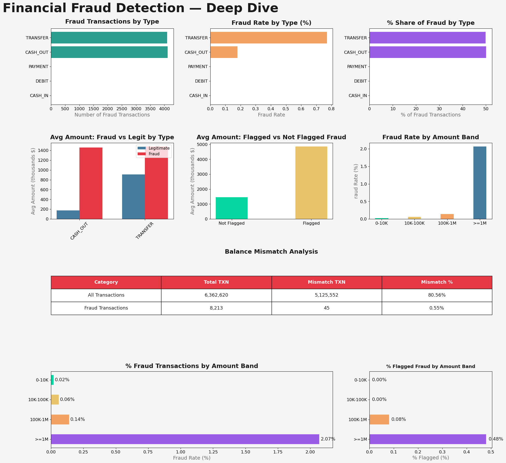

## Key Insights

- Out of 6,362,620 total transactions, only 8,213 transactions were identified as fraudulent, resulting in a fraud rate of just 0.13%.
- Fraudulent activity is almost entirely limited to two transaction types:
   - CASH_OUT: 50.1% of all fraud transactions
   - TRANSFER: 49.9% of all fraud transactions
- The average fraudulent transaction amount is approximately $1,467,967, compared to $178,197 for legitimate transactions. This indicates that fraudsters typically target high-value transactions, increasing the financial impact of each fraud event.
- Transactions exceeding $1 million exhibit the highest fraud rate, making them significantly riskier than lower-value transactions.
   -  0–10K: 0.02%
   - 10K–100K: 0.06%
   - 100K–1M: 0.14%
   - ≥1M: 2.07%
- Current fraud detection performance is weak because while flagged cases are highly accurate, the recall is extremely low indicating that the system is identifying only a very small portion of actual fraudulent transactions.
   - Precision: 100%
   - Recall: 0.19%
   - F1 Score: 0.38%
- The percentage of flagged fraud increases with transaction amount:
   - 0–10K: 0.00%
   - 10K–100K: 0.00%
   - 100K–1M: 0.08%
   - ≥1M: 0.48%

This suggests that existing fraud controls are more focused on large transactions and may overlook fraud occurring in lower-value transactions.
- Balance mismatches alone are not a reliable indicator of fraud and should be combined with other risk factors for effective detection.
   - 80.56% of all transactions
   - Only 0.55% of fraud transactions
 

## Recommendations

- Since 100% of fraud cases originate from CASH_OUT and TRANSFER transactions, fraud prevention efforts should primarily focus on these transaction types.
- Apply enhanced verification for transactions above $1 Million.
- Future improvements should focus on increasing fraud detection coverage while maintaining acceptable accuracy levels.
- Additional behavioral, transactional, and anomaly-based monitoring techniques should be incorporated to improve fraud detection performance.
- The observed patterns in transaction type, amount bands, and fraud behavior provide a strong foundation for developing machine learning models capable of identifying suspicious transactions in real time.

